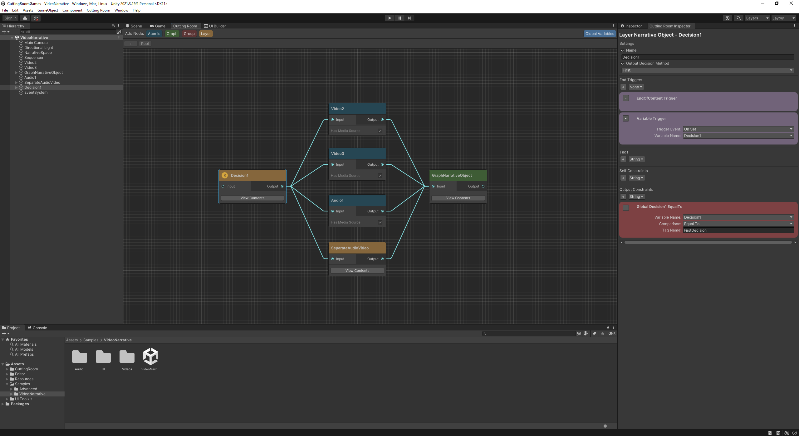

  

 

# Cutting Room

Cutting Room is a plugin for [Unity](https://unity.com) developed by [Digital Creativity Labs](https://digitalcreativity.ac.uk/) at the [University of York](https://york.ac.uk) which allows creators to build and deploy Object Based Media productions.

## What's New?

### Cutting Room is now Event Driven
This latest version of Cutting Room is actually a complete rewrite based off our previous work. It has been redesigned on a fundamental level, moving away from a time driven system to an event driven system. For many users the impact of this change will not be obvious and this is intentional. Cutting Room can still be used to make time based interactive video based narratives, but now the system is free to be driven by more than just time. For video or audio this means reacting to user interactions or implementing mechanisms such as pause or skip are much simpler. Beyond this though it also unlocks the ability for Cutting Room to be used beyond time based media, for example in gaming scenarios (See Advanced Samples).

### Custom Node Based Editor and Inspector

Cutting Room now has a custom Node based editor built into Unity, powered by the Unity GraphView library and a custom Inspector for Cutting Room elements. The editor makes planning and structuring your Object Based Media project much easier. The inspector hides the complexities of the Unity inspector and presents Cutting Room users with only the essential information they need to see. These new tools make creating OBM projects easier than ever and can be used even by those who are not familiar with Unity. 

## Getting Started
Download the latest [Cutting Room Unity Package](https://github.com/Digital-Creativity-Labs/CuttingRoom/releases/latest).
When installing the package to your own project, you also need to add the following to the `manifest.json` of your own project:
`"com.unity.inputsystem": "1.4.4"`
`"com.unity.nuget.newtonsoft-json": "3.0.2"`

and if you want to use the VR support you will need to enable VR support in your project and you can add the XR interaction toolkit to your `manifest.json` as:
`"com.unity.xr.interaction.toolkit": "2.4.1"` 

If you want
* Ensure that you have [Git LFS](https://git-lfs.github.com/) installed.
* Clone or fork the repository: `https://github.com/Digital-Creativity-Labs/CuttingRoom.git`
* Open the project with <b>Unity (2021.3.X or above)</b>.
* Open the Cutting Room Editor and Inspector from the `Cutting Room` menu in the menu bar.
* Build your own productions and share them with us via one of our [communities](https://github.com/Digital-Creativity-Labs/CuttingRoom#community).

## Documentation

Work in progress

## Samples

Samples are available within the `Assets/Samples/CuttingRoom` directory of the repository. This includes the `VideoNarrative` sample scene which showcases an interactive video with a button UI using all of the node types. You can also find samples utilising 360 video in a 2D and VR in the `Immersive` folder. The `Advanced` folder contains examples of using cutting room to change a 3D game scene, although these require a more advanced understanding of unity.

## Contributions

We love seeing pull requests with new features or bug fixes so please feel free to fork the repository and create these if you have something to share with us. Once received, we will examine each one and if satisfied, merge them into the main repository with our thanks.

## Community

You can join us and other Cutting Room creators in the following communities:

* Join and discuss Cutting Room and Object Based Media on [Slack](https://join.slack.com/t/cutting-room-group/shared_invite/zt-13ghccadu-QOVC3uZYppBr4fjBc_KTvw).
* Create and read threads about Cutting Room on [Reddit](https://www.reddit.com/r/cuttingroom/).
* Follow and tweet us [@CuttingRoomOBM](https://twitter.com/CuttingRoomOBM) on Twitter.

## Collaboration

We are always on the look out for new partners to work with to develop innovative and novel products using Cutting Room. If you would like to speak to us about a potential collaboration please reach out to us at [CuttingRoom-toolkit@york.ac.uk](mailto:cuttingroom-toolkit@york.ac.uk).

## Support

If you encounter an issue or just need clarification on existing functionality, please make us aware of this by [submitting an issue](https://github.com/Digital-Creativity-Labs/CuttingRoom/issues) through Github and we will do our best to provide assistance.

## Creators

This tool was developed by [Digital Creativity Labs](https://digitalcreativity.ac.uk) at the [University of York](https://york.ac.uk).
  

&nbsp;&nbsp;&nbsp;&nbsp;&nbsp;&nbsp;&nbsp;&nbsp;&nbsp;&nbsp;&nbsp;&nbsp;&nbsp;&nbsp;&nbsp;&nbsp;
&nbsp;&nbsp;&nbsp;&nbsp;&nbsp;&nbsp;&nbsp;&nbsp;&nbsp;&nbsp;&nbsp;&nbsp;&nbsp;&nbsp;&nbsp;&nbsp;

## Copyright and Licence

Code and documentation copyright 2015-2022 [Digital Creativity Labs](https://digitalcreativity.ac.uk/) and [University of York](https://york.ac.uk).

Code is released under the [Apache 2.0 Licence](https://www.apache.org/licenses/LICENSE-2.0).
